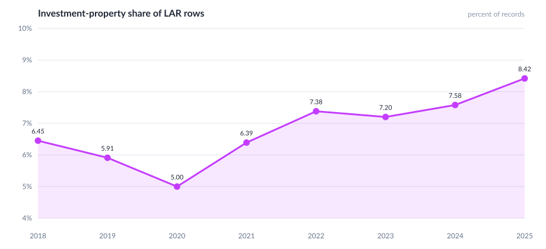

# Investment-property share

## Commentary

- Investment share bottomed at **5.00% in 2020**, then rose to **8.42% in 2025**.
- The count peaked in 2021 (1.67 million) during the volume boom; the **share peaked later**, in 2025.
- That pattern means investor activity held up better than owner-occupant refinances after rates rose.
- Second-home share moved the opposite way over the same years, so the occupancy mix is polarizing toward principal vs. investment.
