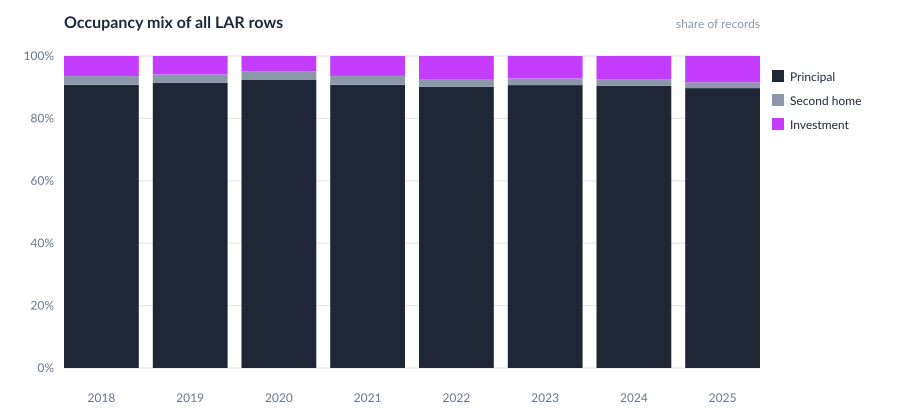

# Occupancy mix, 2018–2025

## Commentary

- Principal residences dominate every modern year: **89.7% to 92.3%** of LAR rows.
- Investment property is the only occupancy class that **gained share after 2020**.
- Second homes are the smallest slice and **fell from 2.80% in 2018 to 1.87% in 2025**.
- Coverage is complete: occupancy_type is populated on **100% of 137.7 million** 2018–2025 rows.
