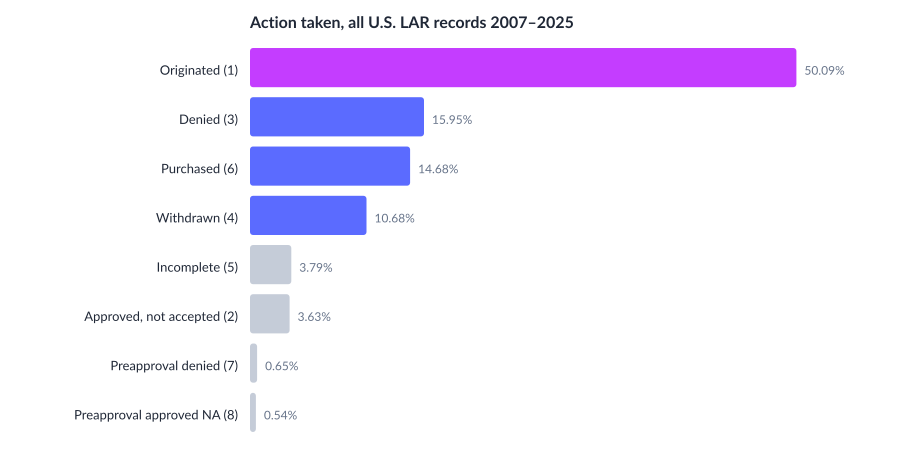

# Action taken, 2007–2025

## Commentary

- **Originated loans are about half** of all LAR records over 2007–2025 (50.1%).
- Denials (16.0%) plus withdrawals (10.7%) together are larger than purchased loans (14.7%).
- Purchased loans (code 6) are secondary-market buys, not this lender’s underwriting decision.
- Preapproval outcomes are small in the national mix (under 1.2% combined).
