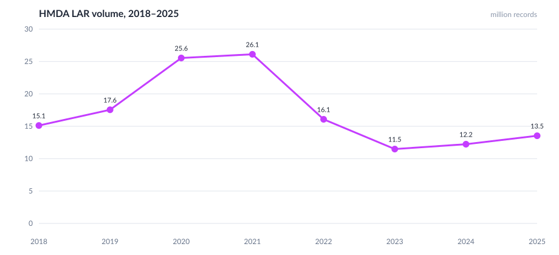

# LAR volume, 2018–2025

## Commentary

- Total LAR rows peaked in **2021 at 26.1 million**, then dropped to **11.5 million in 2023**.
- The 2020–2021 spike is the refinance wave; 2022–2023 is the rate-shock contraction.
- 2024–2025 show a modest rebound (12.2m then 13.5m), still far below the 2021 peak.
- This series counts **every LAR row**, not originated loans only, so it tracks application and purchase activity together.
